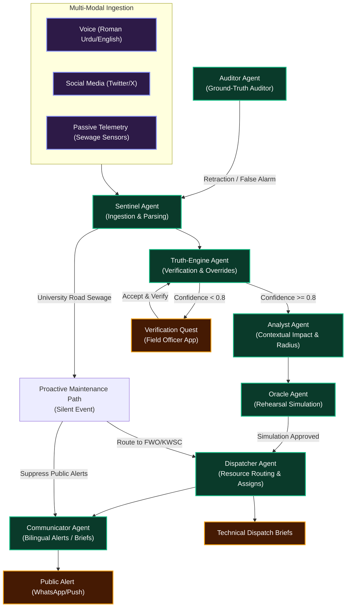

# Project Muhafiz‑X – Sovereign Crisis Intelligence

Muhafiz‑X is a next-generation, agentic crisis-intelligence platform built with **Google Antigravity** as the orchestrator. Fusing passive environmental telemetry, live citizen reports, and social media feeds, the system coordinates automated preemptive responses and first-responder dispatches while enforcing rigorous human-in-the-loop (HITL) safety checks.

---

## 🔄 Swarm Agent Interaction Flow

The interaction between the 9 specialized agents in the swarm and the physical world is illustrated in the Mermaid diagram below. This demonstrates how signals are ingested, verified, simulated, and dispatched.



For a premium visual render of the high-level architecture, see the generated diagram at [assets/architecture_diagram.png](../assets/architecture_diagram.png).

---

## 📂 Documentation Directory Index

This repository contains extensive technical documentation covering every tier of the platform:

1. **[PROJECT_README.md](PROJECT_README.md)** *(this file)* – Overall system overview, agent interactive flows, and index.
2. **[DATA_SCHEMA.md](DATA_SCHEMA.md)** – JSON schemas detailing the exact payload formats exchanged between the citizen app, field officer app, Sentinel, Truth-Engine, and Dispatcher.
3. **[AGENT_ARCHITECTURE.md](AGENT_ARCHITECTURE.md)** – Exhaustive review of the **9-Agent Swarm**'s roles, active code behaviors, and fallback mechanisms when API quotas are constrained.
4. **[ANTIGRAVITY_USAGE.md](ANTIGRAVITY_USAGE.md)** – Practical guide on how Antigravity acts as the task orchestrator, schedules background retries, and maintains system-wide state logs.
5. **[DEMO_SCRIPT.md](DEMO_SCRIPT.md)** – The official 3–5 minute video script outline mapping standard resolution, false alarms, and predictive preemption flows.
6. **[ANTIGRAVITY_TRACE_SAMPLE.md](ANTIGRAVITY_TRACE_SAMPLE.md)** – An actual simulated JSONL trace showing step-by-step model thoughts, tool calls, and sub-agent state transitions.
7. **[design_guidelines.md](../design_guidelines.md)** – The visual guidelines implementing the "Sovereign Digital Pakistan" (Tactical Emerald) UI specifications.

---

## ⚡ Key Architectural Features & Specifications

### 1. Hierarchical Geolocation Onboarding
To prevent spatial hallucinations in coordinates, the Citizen App implements cascading dropdowns:
*   `Province` → `City` → `District` → `Area` → `Landmark/Chowk`.
*   The "Confirm Location" button is hardware-locked and remains disabled until all geospatial levels are populated, guaranteeing high-integrity routing coordinates for first responders.

### 2. Roman Urdu Voice Ingestion
*   Citizens hold a prominent "Hold-to-Report" microphone button.
*   On release, the Roman Urdu audio payload is ingested by the **Sentinel Agent** (powered by the Gemini API).
*   The LLM parses the vernacular dialect into standardized structured JSON data (e.g., extracting `"rain"`, `"flooding"`, and exact local landmarks).

### 3. Verification Quests (Truth-Engine HITL)
*   If the **Truth-Engine** calculates a confidence score of **< 0.8** due to conflicting data sources, it triggers an on-demand **Verification Quest** to the nearest available Field Officer.
*   The Field Officer's app pops up a critical warning modal displaying raw context (e.g., *"Twitter reports heavy fire, but city heat sensors show normal levels"*).
*   Accepting the quest locks the event and shows the fastest dynamic route to the scene.

### 4. System Retraction (Auditor Feedback Loop)
*   If an officer arrives at the scene and reports a false positive, clicking **"False Alarm"** or **"Road Clear"** triggers the **Auditor Agent**.
*   The Auditor executes a POST retraction to the backend, initiating an alert retraction that wipes red polygons off the citizen app and frees up queued rescue vehicles.


---

## 🛠️ Getting Started

### Installation
```bash
# Install core platform dependencies
npm install

# Run backend unit tests and simulation suites
npm run test
```

### Verification
Execute the automated test script to run the scenario suite:
```bash
node run_demo_tests.js
```
This tests the full integration of Sentinel, Truth-Engine, and Dispatcher under high-stakes simulated crisis situations.
